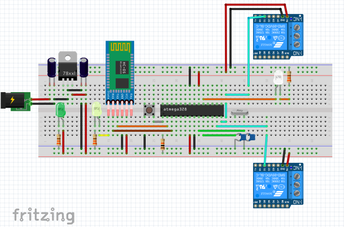

ABOUT

  This project is intended to turn a ordinary power strip into a smart power strip. Using an Arduino UNO, a bluetooth module (HC-05) and two relay modules, you can turn on/off lights and any other eletronic you want to.
  

REQUIRED
  
  ->  Arduino UNO, or MEGA
  
  ->  Bluetooth module (as the HC-05)
  
  ->  Power strip with 2 or more outlets (the one used was the ONEAL-OAC801)
  
  -> 2 relay module
  
  -> 3 LEDS, 3 330 OHMS resistors

CIRCUIT SCHEMATICS

The schematic was made using arduino standalone, but you could certainly use the Arduino UNO Board and its power supply.

